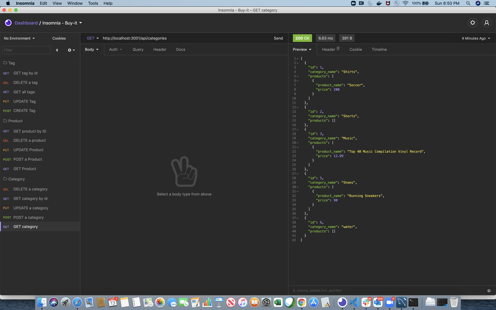
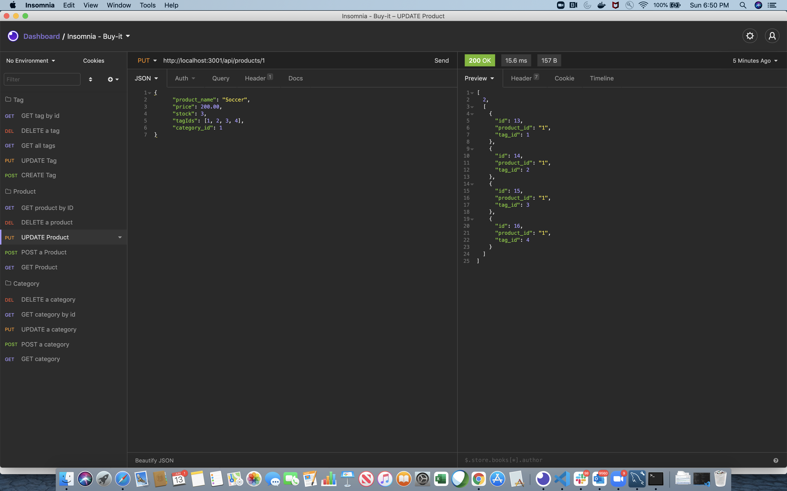
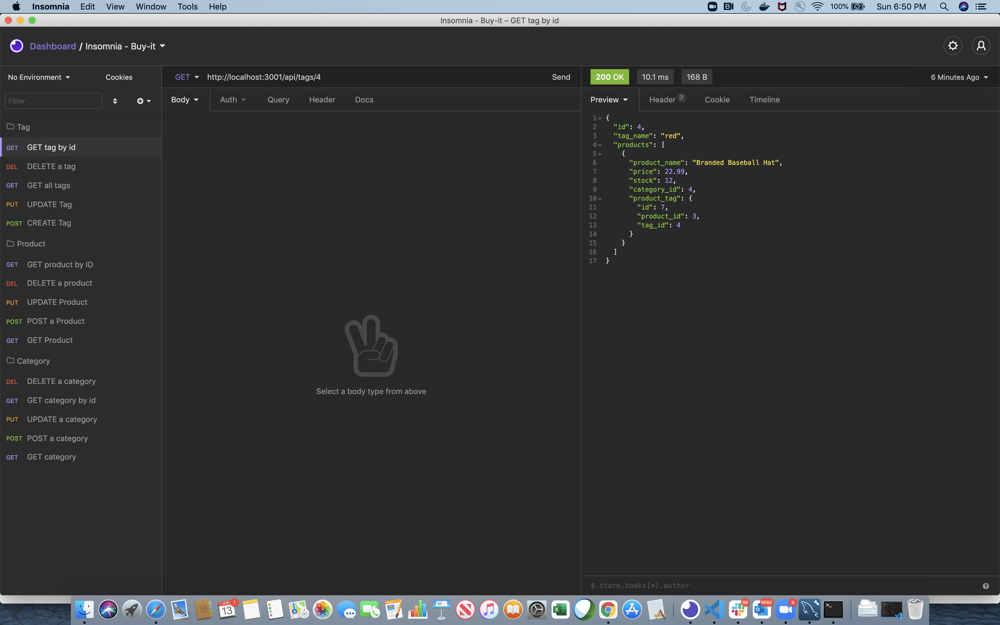

# internet-shopping-backend

Back end for an e-commerce site using express.js, MySQL2 and Sequelize.

# Installation

* Clone the repositry from GitHub and open using Visual Studio Code.
* run the command npm install to install dependencies
* Locally create .env file containing DB_NAME with database name, DB_USER with MySQL username (or 'root'), and DB_PW with MySQL password. Run npm run seed. Then run node server (npm start)

# Usage

Demo video - https://drive.google.com/file/d/1tBXdlxM20Q-q16L6fRXg1wXpO3IsKG3V/view

# Questions

[Contact me](chitra.iyer00@gmail.com)

[GitHub](https://github.com/ciyer87)
